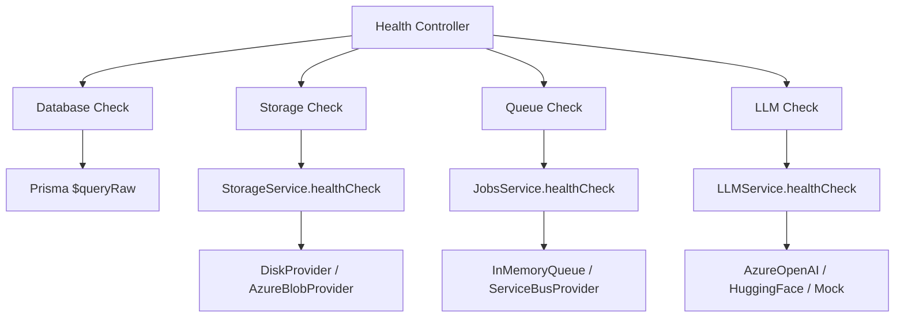

# Health Checks Implementation

**Status:** ✅ Production-Ready  
**Version:** 1.0.0  
**Last Updated:** 3. Dezember 2025

## Overview

Smart Apply implements comprehensive health checks for monitoring application health and readiness. The health check system integrates with Kubernetes/Azure Container Apps liveness and readiness probes.

## Endpoints

### 1. Comprehensive Health Check
**GET** `/api/v1/health`

Checks all critical services:
- **Database** (PostgreSQL with response time)
- **Storage** (Disk/Azure Blob)
- **Queue** (In-Memory/Azure Service Bus)
- **LLM** (Azure OpenAI/Hugging Face/Mock)

**Response (200 OK):**
```json
{
  "status": "ok",
  "info": {
    "database": {
      "status": "up",
      "responseTime": "15ms"
    },
    "storage": {
      "status": "up"
    },
    "queue": {
      "status": "up"
    },
    "llm": {
      "status": "up"
    }
  },
  "error": {},
  "details": {
    "database": {
      "status": "up",
      "responseTime": "15ms"
    },
    "storage": {
      "status": "up"
    },
    "queue": {
      "status": "up"
    },
    "llm": {
      "status": "up"
    }
  }
}
```

**Response (503 Service Unavailable):**
```json
{
  "status": "error",
  "info": {},
  "error": {
    "database": {
      "status": "down",
      "message": "Database is not available"
    }
  },
  "details": {
    "database": {
      "status": "down",
      "message": "Database is not available"
    }
  }
}
```

**Use Case:**
- General health monitoring
- Dashboard displays
- External monitoring systems

---

### 2. Liveness Probe
**GET** `/api/v1/health/live`

Simple check confirming the application process is running.

**Response (200 OK):**
```json
{
  "status": "ok",
  "timestamp": "2025-12-03T19:31:03.539Z"
}
```

**Use Case:**
- Kubernetes liveness probe
- Container orchestration (ACA, Docker)
- Detects if app is frozen/deadlocked

**K8s Configuration:**
```yaml
livenessProbe:
  httpGet:
    path: /api/v1/health/live
    port: 3000
  initialDelaySeconds: 30
  periodSeconds: 10
  timeoutSeconds: 5
  failureThreshold: 3
```

---

### 3. Readiness Probe
**GET** `/api/v1/health/ready`

Checks if the application is ready to accept traffic by verifying critical dependencies:
- **Database** (PostgreSQL)
- **Storage** (Disk/Azure Blob)

**Response (200 OK):**
```json
{
  "status": "ok",
  "info": {
    "database": {
      "status": "up",
      "responseTime": "6ms"
    },
    "storage": {
      "status": "up"
    }
  },
  "error": {},
  "details": {
    "database": {
      "status": "up",
      "responseTime": "6ms"
    },
    "storage": {
      "status": "up"
    }
  }
}
```

**Response (503 Service Unavailable):**
```json
{
  "status": "error",
  "info": {},
  "error": {
    "storage": {
      "status": "down",
      "message": "Storage is not available"
    }
  },
  "details": {
    "storage": {
      "status": "down",
      "message": "Storage is not available"
    }
  }
}
```

**Use Case:**
- Kubernetes readiness probe
- Load balancer health checks
- Prevents routing traffic to unhealthy instances

**K8s Configuration:**
```yaml
readinessProbe:
  httpGet:
    path: /api/v1/health/ready
    port: 3000
  initialDelaySeconds: 10
  periodSeconds: 5
  timeoutSeconds: 3
  successThreshold: 1
  failureThreshold: 3
```

---

## Architecture

### Health Check Flow



### Service-Level Health Checks

Each service implements a `healthCheck()` method:

**Database (PrismaService):**
```typescript
await this.prisma.$queryRaw`SELECT 1`;
```

**Storage (StorageService → Provider):**
```typescript
async healthCheck(): Promise<boolean> {
  // DiskProvider: Check upload directory exists
  // AzureBlobProvider: Test connection
  return true;
}
```

**Queue (JobsService → Provider):**
```typescript
async healthCheck(): Promise<boolean> {
  // InMemoryQueue: Always healthy
  // ServiceBusProvider: Test connection
  return true;
}
```

**LLM (LLMService → Provider):**
```typescript
async healthCheck(): Promise<boolean> {
  // Simple test prompt
  await this.provider.generateText('Test', { maxTokens: 10 });
  return true;
}
```

---

## Rate Limiting

Health check endpoints have generous rate limits to support frequent polling:

- **Rate Limit:** 600 requests / minute (10 per second)
- **TTL:** 60 seconds

**Configuration:**
```typescript
@Throttle({ default: { limit: 600, ttl: 60000 } })
```

**Bypass:** Use `skipThrottle: true` for critical monitoring if needed.

---

## Graceful Degradation

**LLM Service:**
- Non-critical service
- Failures return `status: "degraded"` but don't fail health check
- Application continues without LLM (e.g., manual document editing)

**Example:**
```json
{
  "status": "ok",
  "info": {
    "llm": {
      "status": "degraded",
      "message": "LLM service unavailable"
    }
  }
}
```

---

## Monitoring Integration

### Prometheus Metrics (Future)
```yaml
# /metrics endpoint (requires @nestjs/prometheus)
smartapply_health_check_total
smartapply_health_check_duration_seconds
smartapply_database_response_time_milliseconds
```

### Azure Application Insights
- Health check failures logged as exceptions
- Custom events for service degradation
- Response time tracking

### External Monitoring
- **Uptime Kuma:** Ping `/health/live` every 60s
- **Datadog:** APM + synthetic monitoring
- **Azure Monitor:** Alert rules on 503 responses

---

## Testing

### Manual Testing
```bash
# Main health check
curl http://localhost:3000/api/v1/health | jq

# Liveness probe
curl http://localhost:3000/api/v1/health/live | jq

# Readiness probe
curl http://localhost:3000/api/v1/health/ready | jq
```

### Automated Tests
```bash
cd apps/api
npm run test:e2e -- health.e2e-spec.ts
```

**Test Coverage:**
- ✅ All services healthy
- ✅ Database failure
- ✅ Storage failure
- ✅ LLM degraded (non-critical)

---

## Deployment

### Azure Container Apps (ACA)
```yaml
probes:
  liveness:
    httpGet:
      path: /api/v1/health/live
      port: 3000
    initialDelaySeconds: 30
    periodSeconds: 10
  readiness:
    httpGet:
      path: /api/v1/health/ready
      port: 3000
    initialDelaySeconds: 10
    periodSeconds: 5
```

### Docker Compose
```yaml
services:
  api:
    healthcheck:
      test: ["CMD", "curl", "-f", "http://localhost:3000/api/v1/health/live"]
      interval: 30s
      timeout: 10s
      retries: 3
      start_period: 40s
```

### Azure App Service
```bash
# App Service automatically uses /health endpoint
# Configure in Portal: Monitoring → Health Check
```

---

## Troubleshooting

### Health Check Fails on Startup
**Symptom:** Readiness probe fails immediately after deployment.

**Solution:**
- Increase `initialDelaySeconds` to 30-60s
- Check database migrations complete before health check
- Verify Azure Blob connection string

### High Response Time
**Symptom:** Database response time > 100ms.

**Solution:**
- Check database connection pool size
- Optimize slow queries
- Consider read replicas for high traffic

### LLM Health Check Timeout
**Symptom:** LLM check takes > 5 seconds.

**Solution:**
- Reduce `maxTokens` in health check (currently 10)
- Use mock provider in development
- Skip LLM check in readiness probe (already excluded)

---

## Implementation Details

**Files:**
- `apps/api/src/health/health.controller.ts` - Main controller
- `apps/api/src/health/health.module.ts` - Module definition
- `apps/api/src/prisma/prisma.service.ts` - Database check
- `apps/api/src/storage/storage.service.ts` - Storage abstraction
- `apps/api/src/jobs/jobs.service.ts` - Queue abstraction
- `apps/api/src/llm/llm.service.ts` - LLM abstraction

**Dependencies:**
- `@nestjs/terminus` - Health check framework
- `@nestjs/throttler` - Rate limiting

**Swagger Documentation:**
- Available at: http://localhost:3000/docs
- Search for "health" to see all endpoints

---

## Best Practices

1. **Separate Liveness and Readiness:**
   - Liveness: Quick check (< 100ms)
   - Readiness: Thorough check (< 1s)

2. **Avoid Cascading Failures:**
   - Don't fail health check if non-critical services fail
   - Use degraded status instead

3. **Monitor Response Times:**
   - Database < 50ms (good), 50-100ms (warning), > 100ms (critical)
   - Storage < 200ms
   - Queue < 100ms

4. **Set Proper Thresholds:**
   - Liveness: `failureThreshold: 3` (30s to restart)
   - Readiness: `failureThreshold: 3` (15s to remove from LB)

5. **Log Health Check Failures:**
   - Winston audit logs capture all failures
   - Alert on repeated failures

---

## Next Steps

- [ ] Add Prometheus metrics export
- [ ] Implement circuit breaker for LLM
- [ ] Add health check dashboard UI
- [ ] Set up Azure Monitor alerts
- [ ] Create runbook for health check failures

---

**Last Review:** 3. Dezember 2025  
**Reviewer:** Smart Apply Team  
**Status:** Production-Ready ✅
